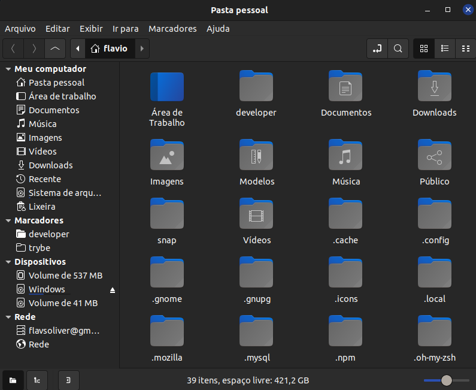

# Nemo

Check: No
Editado: Jun 7, 2021 6:28 PM
Tag Descrição: Gerenciador de Arquivos para Linux
Tag Método: APT

- O Ubuntu traz o Nautilus como Gerenciador de Arquivos padrão. Gosto de usar o Nemo, que é muito eficiente, ótimo layout e boas funcionalidades. Recomendo.

    

    ### Instalação

    1. Para instalar abra o terminal e execute o comando

        ```bash
        sudo apt-get install nemo
        ```

    2. Para tornar o Nemo o Gerenciador padrão execute os comandos

        ```bash
        xdg-mime default nemo.desktop inode/directory application/x-gnome-saved-search
        ```

        ```bash
        gsettings set org.gnome.desktop.background show-desktop-icons false
        ```

        ```bash
        gsettings set org.nemo.desktop show-desktop-icons true
        ```

    3. Para verificar qual Gerenciador é o padrão

        ```bash
        xdg-mime query default inode/directory
        ```

    4. Para trazer o Nautilus novamente para padrão, faça

        ```bash
        xdg-mime default nautilus*.desktop inode/directory application/x-gnome-saved-search
        ```

        ```bash
        gsettings set org.nemo.desktop show-desktop-icons false
        ```

        ```bash
        gsettings set org.gnome.desktop.background show-desktop-icons true
        ```